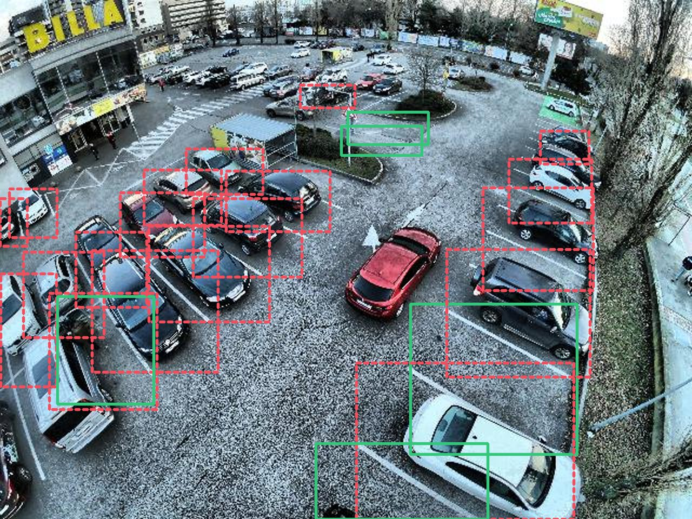

<div align="center">


# ParkWise

**Find open parking spaces in a photo or video, with the neural network running entirely in your browser.**

No server, no upload, no cost.

[**Live demo**](https://parkwise.vercel.app) · [Model card](https://parkwise.vercel.app/model) · [How it works](#how-it-works) · [Develop](#develop)



</div>

---

Point ParkWise at an overhead shot of a parking lot and it reports how many
spaces are free, how many are taken, and where each one is. Your image never
leaves your device. A YOLOv5s detector runs client-side through
[onnxruntime-web](https://onnxruntime.ai/docs/tutorials/web/) on WebGPU, or on
multi-threaded WASM where WebGPU isn't available.

> **From 2022 to 2026.** ParkWise started as an AI Camp summer project in 2022:
> a Flask app running PyTorch on a server. In 2026 it was rebuilt as a fully
> static Next.js site that runs the same weights as ONNX in the browser. The
> original is archived in [`legacy/`](./legacy).

## Features

| Page | What it does |
|---|---|
| [`/detect`](https://parkwise.vercel.app/detect) | Drop in an image or pick one of 20 samples. You get boxes, open and occupied counts, and an occupancy percentage. The confidence and IoU sliders re-filter results in under 2 ms **without re-running the model**. |
| [`/detect/video`](https://parkwise.vercel.app/detect/video) | Drop in a clip. ParkWise samples frames across it and charts occupancy over time. Click anywhere on the chart to jump the video to that point. |
| [`/model`](https://parkwise.vercel.app/model) | A model card covering architecture, training data, the confusion matrix, honest limitations, and live latency measured on your own hardware. |
| [`/debug/parity`](https://parkwise.vercel.app/debug/parity) | Runs the full in-browser pipeline against a PyTorch reference and reports PASS/FAIL with per-box deltas. |

## How it works

```
image ─► canvas letterbox 416×416 ─► Web Worker ─► onnxruntime-web ─► raw tensor ─► decode + NMS ─► canvas overlay
         (never uploaded)              (WebGPU / WASM×4)               (kept in memory)  (TypeScript)
```

1. **Preprocess.** The image is letterboxed to 416×416 on a canvas, padded with `rgb(114,114,114)`, and normalized to RGB/255.
2. **Infer.** A dedicated worker runs the ONNX graph. The worker is the only module that imports onnxruntime-web.
3. **Decode.** The raw `1×10647×7` tensor is decoded in TypeScript: confidence filtering, class-wise NMS, and un-letterboxing back to the image's own coordinates. YOLOv5's Detect head (sigmoid, grid, stride) is baked into the graph, so the JavaScript side needs no anchors.
4. **Render.** Boxes are drawn on a canvas layered over the image, and the counts are aggregated into occupancy stats.

The raw tensor stays in memory, so moving a slider only re-runs step 3.

## Model

| | |
|---|---|
| Architecture | YOLOv5s: 213 layers, 7,015,519 parameters |
| Classes | `0 = Occupied-Parking-Spaces`, `1 = Open-Parking-Spaces` |
| Training data | ~250 Roboflow-labeled aerial frames, one lot, one camera, 2022-07-07 |
| Input | `1×3×416×416` fp32, RGB, /255, letterboxed |
| Output | `1×10647×7`, i.e. (52²+26²+13²) × 3 anchors × (4 xywh + 1 obj + 2 cls) |
| Shipped as | ONNX opset 12, simplified, 27 MB fp32, content-hashed filename |

This is a small model trained on a small, narrow dataset. It does well on
overhead views that look like its training data and gets worse on anything
else: other lots, ground-level phone photos, night. It also tends to produce
duplicate boxes on open spaces. The [model card](https://parkwise.vercel.app/model)
documents all of this.

### Next up: retraining on PKLot

A retrain on **[PKLot](https://doi.org/10.1016/j.eswa.2015.02.009)** is
prepared and ready to run: 12,416 images, 3 lots, sunny, overcast, and rainy
conditions, ~700k labeled spaces. It keeps the same architecture at 640×640, so
the new checkpoint drops straight into the existing export and browser
pipeline. The pinned Colab notebook, the label remapping, and a before/after
evaluation on a shared test split are all in [`tools/train/`](./tools/train).
The shipped model hasn't changed yet.

## Develop

Requires Node 18.18+ (Next.js 15).

```bash
npm install
npm run dev        # http://localhost:3000
```

`predev` and `prebuild` copy the onnxruntime-web `.wasm` binaries and ESM bundle
into `public/ort/`, so no CDN is involved. The worker imports ORT from there at
runtime instead of bundling it. ORT spawns its own threads with
`new Worker(import.meta.url)`, and a bundled `import.meta.url` turns into a
`file://` path that the browser refuses to load.

| Script | |
|---|---|
| `npm run dev` | Dev server |
| `npm run build && npm start` | Production build (fully static) |
| `npm test` | Vitest unit tests for the decode |
| `npm run e2e` | Playwright end-to-end checks against a server on `:3111` |
| `npm run lint` / `npm run typecheck` | ESLint / `tsc --noEmit` |

## Verify

There are three test layers, and each one isolates a different class of bug:

| Layer | Checks | If it fails, the bug is in… |
|---|---|---|
| [`tools/export/verify_parity.py`](./tools/export/verify_parity.py) | PyTorch vs ONNX on the same tensor, plus a hard check on class order. Also writes the fixtures. | the export |
| `npm test` | The raw output tensor fixture, decoded and compared box by box against yolov5's own `non_max_suppression` | the TypeScript decode |
| `npm run e2e` | `/debug/parity`, `/detect`, and `/detect/video` in headless Chromium. Checks cross-origin isolation, that sliders don't re-run inference, and that there are zero console errors. | the letterbox, worker, or UI |

```bash
npx playwright install chromium   # one-time
npm run build && npm start -- -p 3111   # the e2e scripts target :3111
npm run e2e
```

## Deploy

On Vercel, use the **Next.js** preset with no extra configuration. Everything
lives in [`next.config.ts`](./next.config.ts). The whole site prerenders and has
zero serverless functions. `public/` is ~60 MB (model + wasm).

Multi-threaded WASM needs `SharedArrayBuffer`, so the site sends COOP/COEP
headers (`credentialless`). After deploying, open the console on `/detect` and
confirm `crossOriginIsolated === true`. The status line should read
**WASM · 4 threads** or **WebGPU**. Safari doesn't support `credentialless` and
runs single-threaded, which is expected.

> Because of COEP, any third-party embed added later must send CORP/CORS headers.
> Today everything is self-hosted, so this has no cost yet.

## Re-exporting the model

The `.onnx` in `public/models/` is committed, so you only need this after a
retrain. [`tools/export/README.md`](./tools/export/README.md) covers the
version pins (Python 3.11, torch 2.5.1, yolov5 v7.0), content-hashed filenames,
and the **rectangular-vs-square letterbox trap**. Read that section before
debugging any mismatch against the 2022 app's output.

## Project layout

| Path | What |
|---|---|
| `src/app/` | Routes: `/`, `/detect`, `/detect/video`, `/model`, `/debug/parity` |
| `src/lib/detect/` | Preprocessing, decode, NMS: the detection core (+ unit tests) |
| `src/workers/` | The detector worker, the only module that imports onnxruntime-web |
| `src/components/` | Detector, video timeline, model card, and site UI |
| `public/models/` | The shipped ONNX graph (content-hashed, cached immutably) |
| `public/samples/` | 20 sample lot images + manifest |
| `models/best-2022.pt` | Source-of-truth PyTorch checkpoint for the current model |
| `tools/export/` | Offline ONNX export + parity harness (never ships) |
| `tools/train/` | PKLot retraining notebook and label remapping |
| `e2e/` | Playwright scripts and a test timelapse video |
| `legacy/` | The archived 2022 Flask app |

## License

The application code belongs to this repository. The detector is derived from
[Ultralytics YOLOv5](https://github.com/ultralytics/yolov5), which is
**AGPL-3.0**, so the exported weights and the reimplemented decode are
plausibly derivative works. No license file has been chosen yet, on purpose.

## Credits

Built in 2022 by Arya Pradhan, Akira Suzuki, Alex Loan, Dev Patel, Leo Tjong,
and Prisha Sharma through [AI Camp](https://ai-camp.org). Rebuilt for the
browser in 2026.

- Detector architecture and export tooling: [Ultralytics YOLOv5](https://github.com/ultralytics/yolov5) (AGPL-3.0)
- Retraining dataset: Almeida, Oliveira, Silva Jr, Britto Jr, Koerich, *"PKLot – A robust dataset for parking lot classification"*, Expert Systems with Applications 42(11), 2015 (CC BY 4.0)
